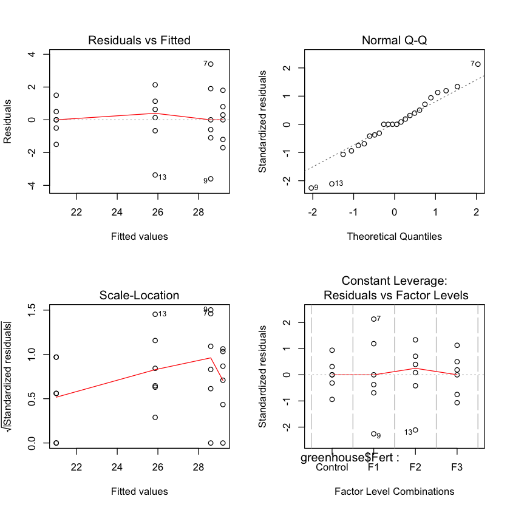

```R
setwd("/Users/yugu/Downloads")
greenhouse<-read.csv("greenhouse.csv")
```


```R
library(tidyverse)
```

    ── Attaching packages ─────────────────────────────────────── tidyverse 1.2.1 ──
    ✔ ggplot2 2.2.1     ✔ purrr   0.2.4
    ✔ tibble  1.4.1     ✔ dplyr   0.7.4
    ✔ tidyr   0.7.2     ✔ stringr 1.2.0
    ✔ readr   1.1.1     ✔ forcats 0.2.0
    ── Conflicts ────────────────────────────────────────── tidyverse_conflicts() ──
    ✖ dplyr::filter() masks stats::filter()
    ✖ dplyr::lag()    masks stats::lag()


```R
is.factor(greenhouse$Fert)
```


TRUE


```R
str(greenhouse)
```

    'data.frame':	24 obs. of  2 variables:
     $ Fert  : Factor w/ 4 levels "Control","F1",..: 1 1 1 1 1 1 2 2 2 2 ...
     $ Height: num  21 19.5 22.5 21.5 20.5 21 32 30.5 25 27.5 ...


```R
summary(greenhouse)
```


          Fert       Height     
     Control:6   Min.   :19.50  
     F1     :6   1st Qu.:22.50  
     F2     :6   Median :27.25  
     F3     :6   Mean   :26.17  
                 3rd Qu.:28.75  
                 Max.   :32.00  


```R
boxplot(greenhouse$Height, 
        horizontal = TRUE, 
        main="Height distribution across all groups",
        col = "blue")
```


```R
boxplot(greenhouse$Height~greenhouse$Fert, 
        main="Fig.-1: Boxplot of Height of Four Brands of Greenhouse", col= rainbow(4))
```


```R
library(ggplot2)
ggplot(greenhouse, aes(Fert,Height))+geom_boxplot(aes(col=Height))+labs(title="Boxplot of Height of Four Brands of Greenhouse")

```


```R
model1<- aov(greenhouse$Height~greenhouse$Fert)

```


```R
summary(model1)

```


                    Df Sum Sq Mean Sq F value   Pr(>F)    
    greenhouse$Fert  3 251.44   83.81   27.46 2.71e-07 ***
    Residuals       20  61.03    3.05                     
    ---
    Signif. codes:  0 ‘***’ 0.001 ‘**’ 0.01 ‘*’ 0.05 ‘.’ 0.1 ‘ ’ 1


```R
TukeyHSD(model1, conf.level = 0.99)

```


      Tukey multiple comparisons of means
        99% family-wise confidence level
    
    Fit: aov(formula = greenhouse$Height ~ greenhouse$Fert)
    
    $`greenhouse$Fert`
                    diff       lwr       upr     p adj
    F1-Control  7.600000  4.021303 11.178697 0.0000016
    F2-Control  4.866667  1.287969  8.445364 0.0005509
    F3-Control  8.200000  4.621303 11.778697 0.0000005
    F2-F1      -2.733333 -6.312031  0.845364 0.0598655
    F3-F1       0.600000 -2.978697  4.178697 0.9324380
    F3-F2       3.333333 -0.245364  6.912031 0.0171033


```R
plot(TukeyHSD(model1, conf.level = 0.99),las=1, col = "red")

```


```R

par(mfrow=c(2,2))

plot(model1)
```





```R
uhat<-resid(model1)
```


```R
hist(uhat, prob=TRUE,col="Blue")
lines(density(uhat))
```


